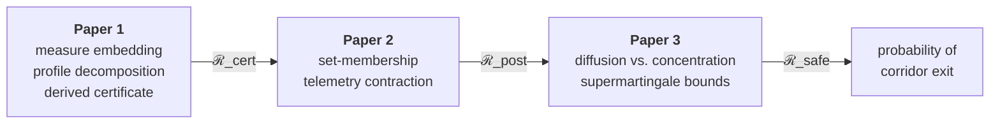

# AETHER 

**Aero-thermo-Elastic Trajectory & Hypersonic Estimation Research**

A three-paper program on *certified* reachable sets for hypersonic entry vehicles, and the
Python package that implements, demonstrates and stress-tests the model the papers reason
about.

The manuscripts are the work. The code is the sandbox they were developed in — a place to
compute the numbers the papers are allowed to quote, and to find out which claims survive
contact with an actual solver.

---

## The problem

The reachable set of a hypersonic entry vehicle — every state it can be driven to under
admissible control — is what safety-critical and threat analysis actually need bounded.
Computing it exactly means solving a Hamilton–Jacobi–Isaacs equation on a grid: exponential
in state dimension, capped in practice around four or five states. A rigid-body entry
vehicle has thirteen before any augmentation, and twenty-five once ablation, heat load and
structural deformation are carried.

Worse, a grid gives a numerical approximation, not a certificate. And a polynomial barrier
whose coefficients came out of an interior-point solver has analytical *form* but inherits
the solver's accuracy. There are two things to beat here, not one.

## The approach

Embed the hybrid vehicle dynamics into a Banach space of occupation measures, where the
problem becomes **linear** despite the nonlinearity of the flight mechanics. In the
thin-atmosphere limit the resulting measure family is *not compact*: mass concentrates onto
a low-dimensional set of trajectories. Turn that failure of compactness into a profile
decomposition — a finite-dimensional skeleton, one boundary-layer profile per event, and a
residual with a quantitative bound — and use its structure to **derive** a comparison
certificate rather than search for one numerically.

The bound is then analytical in the strong sense: derived by hand, discharged in exact
rational arithmetic over the entry corridor. Sum-of-squares programming appears only as an
independent numerical cross-check, never as the source of the guarantee.

## The series



The output of each paper is the object the next one operates on, and the containment

```
ℛ_safe  ⊆  ℛ_post  ⊆  ℛ_cert
```

is a monotone set-containment argument rather than an analogy: all three are supports of
occupation measures related by set-valued operations on the same Liouville-governed measure.
Paper 2 re-weights it by a likelihood; Paper 3 replaces Liouville by Kolmogorov-forward and
diffuses it.

| # | Title | What it adds |
|---|-------|--------------|
| **1** | Certified Analytical Bounds for Multi-Phase Hypersonic Reachable Sets | the embedding, the decomposition, the certificate |
| **2** | Sequential Telemetry and the Contraction of Certified Reachable Sets | successive measurements tighten the bound |
| **3** | Supermartingale Bounds for Multi-Phase Hypersonic Reachable Sets under Stochastic Forcing | unbounded noise; the guarantee changes kind |

Paper 3's guarantee is weaker in kind, not merely in constant: under unbounded noise no
compact set contains the state almost surely, so deterministic containment becomes a
probability of exit. That distinction is stated in its abstract rather than buried.

---

## The model

**Six degrees of freedom, plus what deforms.** Attitude and body rates are states; angle of
attack and sideslip are *outputs* of the attitude solution, not commanded quantities.
Controls are flap deflections, RCS moments and throttle. Trim is never assumed solvable, so
attitudes the vehicle cannot hold are excluded automatically rather than by fiat.

**Multi-phase.** Vacuum and atmospheric flight, with and without thrust, are modes of a
hybrid system. Equilibrium glide, skip-glide, boost-glide and fractional-orbit profiles are
admissible *words* over that alphabet rather than separate models — so results hold for
every family in the class without enumerating them.

**The corridor is load-bearing mathematically, not just physically.** Heating rate, dynamic
pressure, load factor and integrated heat load are what make the state set compact, and
compactness is a hypothesis of every result in the series. The hypersonic physics does
mathematical work.

### Enclosed, or resolved — never fitted-and-hoped

Every effect the model carries enters the certificate in one of exactly two ways. Effects
that cannot be resolved at this fidelity are **enclosed**: shown to lie in a computable
envelope over the corridor, so the differential inclusion they generate bounds every
selection, hence the truth. Effects that can be resolved are carried as **states with their
own rate laws**.

| Effect | Treatment |
|---|---|
| Real-gas and Mach-dependent aerodynamics | enclosed — envelope on the coefficient maps |
| Rarefaction / Knudsen bridging | enclosed — constitutive regime boundary |
| Wind | enclosed — certified bound from reanalysis climatology |
| Frame coupling of aero force into inertial energy | enclosed — sharp constant from the load-factor constraint |
| Higher-order piston-theory forcing | enclosed — keeps the load-bearing pencil linear |
| Ablation recession | **resolved** — state, bounded by the heat-load budget |
| Integrated heat load | **resolved** — state with a polynomial rate equation |
| **Aerothermoelastic deformation** | **resolved** — modal state, temperature-dependent banded stiffness, first-order piston forcing |

Aerothermoelasticity was the last effect whose bound was *assumed* rather than certified.
Resolving it means the program is no longer "occupation measures, plus a special argument
for skips, plus a separate story for elasticity" — it is one method with one standing
hypothesis, a uniform spectral gap, whose certification is itself the point. The flutter
margin is not a separate theorem; it *is* the certificate that the modal bound is
forward-invariant under the true dynamics rather than posited.

### Exact polynomial closure

Everything above is made polynomial *exactly*, by adjoining auxiliary states rather than by
fitting: density as `y = √(ρ/ρ₀)` with `ẏ ∝ y`, and the temperature-dependent elastic
modulus by the same exponential lift, `ẇ ∝ w·Ṫ`. No fit residual is smuggled in as a
disturbance. That closure is the keystone every downstream result routes through.

### What the framework does and does not own

It owns **propagation fidelity**: given the input models and their uncertainty, that
uncertainty is carried into reachable-set uncertainty soundly and without leakage. It does
not own **flow-physics fidelity** — the coefficient envelopes, the temperature field, the
softening law, transition and shock/boundary-layer interaction are empirical inputs with
their own error bars, and no amount of analysis manufactures fidelity that is not in them.

The honest headline is therefore: *the tightest certified reachable set consistent with the
fidelity of the aerothermodynamic inputs, with that fidelity faithfully propagated and never
silently exceeded.*

---

## Status

**Early, and deliberately explicit about it.**

Paper 1's model chapter and Appendices A–E are drafted. Sections 3 through 7 are section
structure. The only theorem environments that exist anywhere are the sub-escape assumption
and the forward-invariance lemma — the three headline contributions are unwritten, and
nothing in the manuscripts should yet be read as a claim.

The shared bibliography, [`manuscripts/shared.bib`](manuscripts/shared.bib), is assembled by
hand: entries are added as sources are read and their details checked against the published
record, rather than generated and hoped over.

### Building the papers

```bash
cd manuscripts
./build.sh                 # all three papers
./build.sh paper1          # one paper
./build.sh watch paper1    # continuous rebuild
./build.sh clean           # remove build artifacts
```

`make` does the same where it is installed; `build.sh` is the portable entry point.

---

## The code

An applied implementation of the model the papers reason about — used to demonstrate that
the physics closes, to generate the numbers the manuscripts are permitted to quote, and as a
sandbox for testing whether a modeling decision survives being computed.

It is **not** the contribution, and no result in the papers depends on a float it produces.
The one exception runs the other way: the certificate's exact-arithmetic verification is a
script that checks the derived bound and exits nonzero on failure, and *that* script is the
artifact carrying the guarantee.

### Package layout

| Module | Contents |
|---|---|
| `spectral/` | Chebyshev–Gauss–Lobatto operators by direct recurrence with the negative-sum trick; Clenshaw–Curtis quadrature; barycentric interpolation |
| `ultraspherical/` | Olver–Townsend banded operators and assembly — the bandedness the sparsity argument rests on |
| `structures/` | Variable-rigidity Euler–Bernoulli operator with the full product-rule expansion; free-free BCs by null-space projection; modal reduction; integrators |
| `plates/` | Mindlin plates, laminate stiffness |
| `coupling/` | Quadrature-normalized kernel force transfer |
| `thermal/` | Landau immobilization frame; semi-discrete charring/Stefan solver on the fixed grid |
| `fiat/` | Fully implicit ablation and thermal response of a multilayer TPS stack; independent implementation of the Chen–Milos formulation |
| `aerothermal/` | Fay–Riddell stagnation heating with the Lewis exponent stated; modified-Newtonian velocity gradient |
| `aerodynamics/` | Five methods, each valid somewhere and none everywhere — modified-Newtonian and Prandtl–Meyer impact, panels, free-molecular closure |
| `geometry/` | Outer mould line from a mesh; measured shape scalars rather than stipulated ones |
| `atmosphere/` | US Standard 1976, MSIS thermosphere, ERA5 reanalysis winds |
| `dynamics/` | Quaternion attitude kinematics with norm-error diagnostics; incidence on a deformed surface |
| `flight/` | The coupled simulator: thirteen rigid-body states augmented by mass, recession and retained structural modes, as one system of ODEs |
| `orbital/` | Two-body astrodynamics over an arbitrary central body; Lambert targeting; atmospheric coast |
| `guidance/` | Proportional navigation and its augmented form; strapdown inertial propagation; stable time-to-go |
| `optimal_control/` | Legendre–Gauss–Lobatto direct transcription and Pontryagin refinement over an arbitrary problem |
| `estimation/` | Adaptive state estimation: χ² anomaly gating and IAE |
| `certification/` | Machinery answering "is this inequality *provably* true", as distinct from "did a float suggest so" |
| `batch/` | NumPy/CuPy backend abstraction; batched common-outer-grid integrator — a Monte Carlo batch as a rank-3 tensor operation |
| `viz/` | Textured WGS84 ellipsoid, terrain and imagery tiles, vehicle glyphs |
| `verification/` | Executable verification tasks with failure criteria stated in advance |

### Setup

```bash
pip install -e ".[dev]"
pip install -e ".[atmosphere]"   # optional: MSIS thermosphere
pip install -e ".[reanalysis]"   # optional: ERA5 winds
pip install -e ".[cuda]"         # optional: GPU batch backend
```

### Running

```bash
pytest tests -q                  # 590 tests
python -m aether.verification    # verification tasks -> results/
```

Each verification task states its failure criterion **before** it runs and writes a
timestamped Markdown report with the environment recorded. Criteria for the numerics tasks
are inherited from earlier manuscripts on the fixed-grid spectral method and its plate and
aerothermal applications; the `R1-` prefixed tasks serve this reachability series.

---

## Repository boundary

This repository is public and holds a one-way dependency boundary: the public kernel must
not import controlled code, which lives in a separate repository rather than in an ignored
subdirectory here. An ignored directory is one `git add -f` away from being published; a
separate repository is not. The boundary is checked by
[`tools/check_boundary.py`](tools/check_boundary.py).

Vehicle parameters throughout are generic and individually cited — a plausible lifting body
with published mass properties and reference dimensions, traceable to no system.

## License

MIT. See [`LICENSE`](LICENSE).
