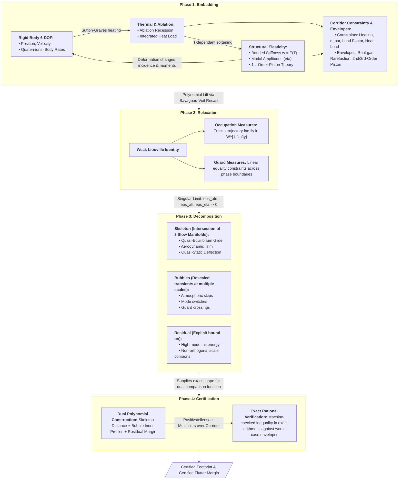

# AETHER: Aero-thermo-Elastic Trajectory & Hypersonic Estimation Research

*The motivating idea*: Solve the coupled, highly nonlinear dynamics of a manuevering hypersonic body **weakly**, and extract a finite-dimensional skeleton in the form of a trajectory outer-bound via Galerkin projection.

This then evolved into a tentative thesis proposal on *certified* reachable sets for hypersonic entry vehicles, and the
Python package that implements, demonstrates and stress-tests the model.




---

## The problem

The reachable set of a hypersonic entry vehicle — every state it can be driven to under
admissible control — is what safety-critical and threat analysis actually need bounded.
Computing it exactly means solving a Hamilton–Jacobi–Isaacs equation on a grid: exponential
in state dimension, capped in practice around four or five states. A rigid-body entry
vehicle has thirteen before any augmentation, and twenty-five once ablation, heat load and
structural deformation are carried.

Worse, a grid gives a numerical approximation, not a certificate. And a polynomial barrier
whose coefficients came out of an interior-point solver has analytical *form* but inherits
the solver's accuracy. There are two things to beat here, not one.

## The approach

Embed the hybrid vehicle dynamics into a Banach space of occupation measures, where the
problem becomes **linear** despite the nonlinearity of the flight mechanics. In the
thin-atmosphere limit the resulting measure family is *not compact*: mass concentrates onto
a low-dimensional set of trajectories. Turn that failure of compactness into a profile
decomposition — a finite-dimensional skeleton, one boundary-layer profile per event, and a
residual with a quantitative bound — and use its structure to **derive** a comparison
certificate rather than search for one numerically.

The bound is then analytical in the strong sense: derived by hand, discharged in exact
rational arithmetic over the entry corridor. Sum-of-squares programming appears only as an
independent numerical cross-check, never as the source of the guarantee.

## The proposal

The research program is being written up as a PhD thesis proposal, built from the model and
embedding material of an earlier manuscript draft. It lives in
[`manuscript/proposal/`](manuscript/proposal/) and is public as it is written.

The chain it sets out:

1. **Coupled entry dynamics.** A continuum ODE–PDE model of the entry body: rigid-body 6-DOF,
   ablation and heat load, and aerothermoelastic deformation, with its assumptions stated
   and minimal.
2. **Polynomial embedding.** The model made polynomial *exactly*, by adjoining auxiliary
   states rather than by fitting.
3. **Occupation measures and compactness.** The embedded system lifted to a linear problem on
   measures, and the compactness the corridor constraints supply, verified.
4. **Decomposition and certificate.** The concentration that compactness fails by, turned
   into a profile decomposition and from there into a derived, exactly verified bound.

The model is **vehicle-agnostic**: no result depends on a particular body's geometry,
materials or data, which enter only as inputs, either as specific values or as certified
class envelopes, with the reachable sets nesting accordingly.

---

## The model

**Six degrees of freedom, plus what deforms.** Attitude and body rates are states; angle of
attack and sideslip are *outputs* of the attitude solution, not commanded quantities.
Controls are flap deflections, RCS moments and throttle. Trim is never assumed solvable, so
attitudes the vehicle cannot hold are excluded automatically rather than by fiat.

**Multi-phase.** Vacuum and atmospheric flight, with and without thrust, are modes of a
hybrid system. Equilibrium glide, skip-glide, boost-glide and fractional-orbit profiles are
admissible *words* over that alphabet rather than separate models — so results hold for
every family in the class without enumerating them.

**The corridor is load-bearing mathematically, not just physically.** Heating rate, dynamic
pressure, load factor and integrated heat load are what make the state set compact, and
compactness is a hypothesis of every result in the proposal. The hypersonic physics does
mathematical work.

### Enclosed, or resolved — never fitted-and-hoped

Every effect the model carries enters the certificate in one of exactly two ways. Effects
that cannot be resolved at this fidelity are **enclosed**: shown to lie in a computable
envelope over the corridor, so the differential inclusion they generate bounds every
selection, hence the truth. Effects that can be resolved are carried as **states with their
own rate laws**.

| Effect | Treatment |
|---|---|
| Real-gas and Mach-dependent aerodynamics | enclosed — envelope on the coefficient maps |
| Rarefaction / Knudsen bridging | enclosed — constitutive regime boundary |
| Wind | enclosed — certified bound from reanalysis climatology |
| Frame coupling of aero force into inertial energy | enclosed — sharp constant from the load-factor constraint |
| Higher-order piston-theory forcing | enclosed — keeps the load-bearing pencil linear |
| Ablation recession | **resolved** — state, bounded by the heat-load budget |
| Integrated heat load | **resolved** — state with a polynomial rate equation |
| **Aerothermoelastic deformation** | **resolved** — modal state, temperature-dependent banded stiffness, first-order piston forcing |

Aerothermoelasticity was the last effect whose bound was *assumed* rather than certified.
Resolving it means the program is no longer "occupation measures, plus a special argument
for skips, plus a separate story for elasticity" — it is one method with one standing
hypothesis, a uniform spectral gap, whose certification is itself the point. The flutter
margin is not a separate theorem; it *is* the certificate that the modal bound is
forward-invariant under the true dynamics rather than posited.

### Exact polynomial closure

Everything above is made polynomial *exactly*, by adjoining auxiliary states rather than by
fitting: density as `y = √(ρ/ρ₀)` with `ẏ ∝ y`, and the temperature-dependent elastic
modulus by the same exponential lift, `ẇ ∝ w·Ṫ`. No fit residual is smuggled in as a
disturbance. That closure is the keystone every downstream result routes through.

### What the framework does and does not own

It owns **propagation fidelity**: given the input models and their uncertainty, that
uncertainty is carried into reachable-set uncertainty soundly and without leakage. It does
not own **flow-physics fidelity** — the coefficient envelopes, the temperature field, the
softening law, transition and shock/boundary-layer interaction are empirical inputs with
their own error bars, and no amount of analysis manufactures fidelity that is not in them.

The honest headline is therefore: *the tightest certified reachable set consistent with the
fidelity of the aerothermodynamic inputs, with that fidelity faithfully propagated and never
silently exceeded.*

---

## Status

**Early, and deliberately explicit about it.**

The proposal currently contains its first appendix: the coupled 6-DOF entry dynamics and
their polynomial embedding. The later chapters are being drafted, and nothing in the
manuscript should yet be read as a claim.

The shared bibliography, [`manuscript/shared.bib`](manuscript/shared.bib), is assembled by
hand: entries are added as sources are read and their details checked against the published
record, rather than generated and hoped over.

### Building the proposal

```bash
make proposal          # latexmk -> manuscript/proposal/main.pdf
make clean-proposal    # remove build artifacts
```

---

## The code

An implementation of the model the proposal reasons about, used to show that the physics
closes, to generate the numbers the manuscript is permitted to quote, and as a sandbox for
testing whether a modeling decision survives being computed.

It is **not** the contribution, and no result in the proposal depends on a float it produces.
The one exception runs the other way: the certificate's exact-arithmetic verification is a
script that checks the derived bound and exits nonzero on failure, and *that* script is the
artifact carrying the guarantee.

### The demonstration: Artemis I

[`examples/artemis1/`](examples/artemis1/) flies Orion's Artemis I lunar-return
skip entry from its published entry interface to terminal speed, and every input is
either taken from a NASA source cited where it is used or computed by this package
from those numbers:

- the Orion shape from the CEV wind-tunnel proportions, and its hypersonic drag from
  the Newtonian panel method at the design L/D -- which lands the trim angle inside
  the band the Orion aerodynamic database gives, without being asked to;
- the flight through a predictor-corrector skip guidance in the PredGuid lineage
  (`aether.guidance.skip`), against an atmosphere and an L/D that differ from the
  guidance's model by what the flight's own estimators reported;
- the flight flown with the body rolling at a finite rate, which is not a detail: a
  reversal sweeps the lift vector through wings-level, and a loop that assumes the
  commanded bank is reached instantly plans a trajectory the body cannot fly;
- the reachable landing footprint from entry interface, skip apogee and the start of
  the Final phase, with the target inside it as it shrinks;
- a **certified** upper bound on the downrange still available, holding for every
  admissible bank history and for atmospheres 0.85 to 1.15 times standard, discharged
  in exact ball arithmetic and conditional on a stated corridor. Inner sweep and outer
  certificate bracket the flown trajectory between them.

Against the flight: Final phase at 538 s (flown 551 s), Terminal at 880 s (882 s),
skip apogee 284 kft (287 kft), and the Terminal phase starting 2.0 nmi from the
target (2.7 nmi).

### Package layout

| Module | Contents |
|---|---|
| `spectral/` | Chebyshev–Gauss–Lobatto operators by direct recurrence with the negative-sum trick; Clenshaw–Curtis quadrature; barycentric interpolation |
| `ultraspherical/` | Olver–Townsend banded operators and assembly — the bandedness the sparsity argument rests on |
| `structures/` | Variable-rigidity Euler–Bernoulli operator with the full product-rule expansion; free-free BCs by null-space projection; modal reduction; integrators |
| `plates/` | Mindlin plates, laminate stiffness |
| `coupling/` | Quadrature-normalized kernel force transfer |
| `thermal/` | Landau immobilization frame; semi-discrete charring/Stefan solver on the fixed grid |
| `fiat/` | Fully implicit ablation and thermal response of a multilayer TPS stack; independent implementation of the Chen–Milos formulation |
| `aerothermal/` | Fay–Riddell stagnation heating with the Lewis exponent stated; modified-Newtonian velocity gradient |
| `aerodynamics/` | Modified-Newtonian and Prandtl–Meyer impact, panels, skin friction, real-gas and free-molecular closures; axisymmetric Euler CFD for the sub- and transonic band |
| `cfd/` | Three-dimensional SU2 across the flight envelope: shock-fitted grids, preflight checks, a run registry and worker that survive a dropped connection, and the sweep that turns solved runs into aerodynamic tables; plasma sheath and RF blackout from the shock layer |
| `geometry/` | Outer mould line from a mesh; measured shape scalars rather than stipulated ones. `prep` conditions an authored STL into a master — consistent winding, degenerate facets dropped, units and orientation normalised — and writes a manifest recording every repair and factor applied |
| `atmosphere/` | US Standard 1976, MSIS thermosphere, ERA5 reanalysis winds |
| `dynamics/` | Quaternion attitude kinematics with norm-error diagnostics; incidence on a deformed surface |
| `flight/` | The coupled simulator: thirteen rigid-body states augmented by mass, recession and retained structural modes, as one system of ODEs |
| `orbital/` | Two-body astrodynamics over an arbitrary central body; atmospheric coast |
| `guidance/` | Entry guidance: drag tracking and bank-angle modulation; the entry trajectory as an optimal control problem; landing footprints by bank-schedule sweep, bracketed by the optimised outer edge |
| `trajectory/` | Reference trajectories as pseudospectral polynomials; problem specification, objectives, constraints and phase triggers; an offline library handed to the guidance loop as its nominal |
| `optimal_control/` | Legendre–Gauss–Lobatto direct transcription and Pontryagin refinement over an arbitrary problem |
| `estimation/` | Adaptive state estimation (χ² anomaly gating and IAE), navigation through plasma blackout, and heterogeneous measurement models with their covariance |
| `certification/` | Machinery answering "is this inequality *provably* true", as distinct from "did a float suggest so": rigorous enclosures and verified reachable tubes in Arb ball arithmetic, the entry field written for every arithmetic at once, monotone density enclosures, and a certified downrange bound that carries the corridor hypothesis it rests on |
| `batch/` | NumPy/CuPy backend abstraction; batched common-outer-grid integrator — a Monte Carlo batch as a rank-3 tensor operation; terminal dispersion from measured ERA5 winds, with exact elliptical containment radii checked against Siouris Table 5.2 |
| `viz/` | Textured WGS84 ellipsoid, terrain and Blue Marble Next Generation imagery tiles, vehicle glyphs, flow-field rendering, and `scene` — a chase-camera rig with polyline, mesh and glyph projection over the globe |
| `verification/` | Executable verification tasks with failure criteria stated in advance |

### Setup

```bash
pip install -e ".[dev]"
pip install -e ".[atmosphere]"   # optional: MSIS thermosphere
pip install -e ".[reanalysis]"   # optional: ERA5 winds
pip install -e ".[cuda]"         # optional: GPU batch backend
```

CFD additionally needs SU2 and gmsh, which are not pip-installable; see
[`aether/geometry/backend.py`](src/aether/geometry/backend.py) for what is looked for and where.

### Running

```bash
make test                        # the test suite
make verify                      # verification tasks -> results/
make example                     # the Artemis I skip entry
```

Each verification task states its failure criterion **before** it runs and writes a
timestamped Markdown report with the environment recorded.

---

## Repository boundary

This repository is public and holds a one-way dependency boundary: the public kernel must
not import controlled code, which lives in a separate repository rather than in an ignored
subdirectory here. An ignored directory is one `git add -f` away from being published; a
separate repository is not. The boundary is checked by
[`tools/check_boundary.py`](tools/check_boundary.py).

The demonstration vehicle is NASA's Orion capsule, and every parameter it uses is taken from
the open literature and cited where it is used.

## License

MIT. See [`LICENSE`](LICENSE).
