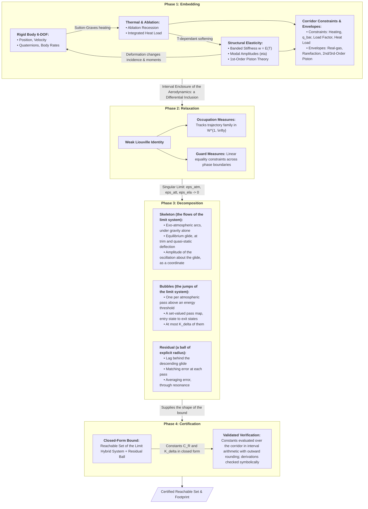

# AETHER: Aero-thermo-Elastic Trajectory & Hypersonic Estimation Research

*The motivating idea*: Solve the coupled, highly nonlinear dynamics of a maneuvering hypersonic body **weakly**, and extract a finite-dimensional skeleton in the form of a trajectory outer-bound via Galerkin projection.

This then evolved into a tentative thesis proposal on *certified* reachable sets for hypersonic entry vehicles, and the
Python package that implements, demonstrates and stress-tests the model.


```mermaid
flowchart TD
    subgraph phase1_embedding ["<b>Phase 1: Embedding</b>"]
    direction LR

    rigid_body_6-dof["<b>Rigid Body 6-DOF:</b>
    • Position, Velocity
    • Quaternions, Body Rates"]
    style rigid_body_6-dof text-align:left
    thermal_ablation["<b>Thermal & Ablation:</b>
    • Ablation Recession
    • Integrated Heat Load"]
    style thermal_ablation text-align:left
    corridor_constraints_envelopes["<b>Corridor Constraints & Envelopes:</b>
    • Constraints: Heating, q_bar, Load Factor, Heat Load
    • Envelopes: Real-gas, Rarefaction, 2nd/3rd-Order Piston"]
    style corridor_constraints_envelopes text-align:left
    structural_elasticity["<b>Structural Elasticity:</b>
    • Banded Stiffness w = E(T)
    • Modal Amplitudes (eta)
    • 1st-Order Piston Theory"]
    style structural_elasticity text-align:left
    rigid_body_6-dof-- "Sutton-Graves heating" -->thermal_ablation
    thermal_ablation-- "T-dependant softening" -->structural_elasticity
    structural_elasticity-- "Deformation changes incidence & moments" -->rigid_body_6-dof
    thermal_ablation & structural_elasticity-->corridor_constraints_envelopes
    end

    subgraph phase2_relaxation ["<b>Phase 2: Relaxation</b>"]
    direction LR
    weak_liouville_identity["<b>Weak Liouville Identity</b>"]
    occupation_measures["<b>Occupation Measures:</b> Tracks trajectory family in W^{1, \infty}"]
    guard_measures[<b>Guard Measures:</b> Linear equality constraints across phase boundaries]
    weak_liouville_identity-->occupation_measures & guard_measures
    end

    subgraph phase3_decomposition ["<b>Phase 3: Decomposition</b>"]
    direction LR
    skeleton["<b>Skeleton (the flows of the limit system):</b>
    • Exo-atmospheric arcs, under gravity alone
    • Equilibrium glide, at trim and quasi-static deflection
    • Amplitude of the oscillation about the glide, as a coordinate"]
    style skeleton text-align:left
    bubbles["<b>Bubbles (the jumps of the limit system):</b>
    • One per atmospheric pass above an energy threshold
    • A set-valued pass map, entry state to exit states
    • At most K_delta of them"]
    style bubbles text-align:left
    residual["<b>Residual (a ball of explicit radius):</b>
    • Lag behind the descending glide
    • Matching error at each pass
    • Averaging error, through resonance"]
    style residual text-align:left
    end

    subgraph phase4_certification ["<b>Phase 4: Certification</b>"]
    direction LR
    closed_form_bound["<b>Closed-Form Bound:</b> Reachable Set of the Limit Hybrid System + Residual Ball"]
    validated_verification["<b>Validated Verification:</b> Constants evaluated over the corridor in interval arithmetic with outward rounding; derivations checked symbolically"]
    closed_form_bound-- "Constants C_R and K_delta in closed form" -->validated_verification
    end

   phase1_embedding-- "Interval Enclosure of the Aerodynamics: a Differential Inclusion" -->phase2_relaxation
   phase2_relaxation-- "Singular Limit: eps_atm, eps_att, eps_ela -> 0" -->phase3_decomposition
   phase3_decomposition-- "Supplies the shape of the bound" -->phase4_certification
   phase4_certification-->A@{ shape: lean-r, label: "Certified Reachable Set & Footprint" }
```


---

## The problem

The reachable set of a hypersonic entry vehicle — every state it can be driven to under
admissible control — is what a safety analysis actually needs bounded.
Computing it exactly means solving a Hamilton–Jacobi–Isaacs equation on a grid: exponential
in state dimension, capped in practice around four or five states. A rigid-body entry
vehicle has thirteen before any augmentation, and sixteen plus two per structural mode and
two per cell of heat shield once the heat load, the mass and the heat shield in depth, with
its recession, are carried.

Worse, a grid gives a numerical approximation, not a certificate. And a polynomial barrier
whose coefficients came out of an interior-point solver has analytical *form* but inherits
the solver's accuracy. There are two things to beat here, not one.

## The approach

Embed the hybrid vehicle dynamics into a Banach space of occupation measures, where the
problem becomes **linear** despite the nonlinearity of the flight mechanics. In the
thin-atmosphere limit the measure family still converges — the corridor is compact — but
its limit *forgets every atmospheric pass*: a pass lasts a vanishing time and can still
carry a finite share of the energy dissipated, and a reachable set is a support, not an
integral. Read the loss where it occurs, on the dissipation along the rescaled time axis,
and turn it into a profile decomposition — a limit system in a few slow coordinates, one
boundary-layer profile per pass, entering as a jump, and a residual of explicit radius — and
use its structure to **derive** the bound rather than search for one numerically.

How much the limit forgets depends on which limit is taken. With the corridor's load limits
held fixed nothing concentrates, and the passes are the troughs of an oscillation about the
glide; concentration needs an entry angle that stays large against the square root of the
small parameter. Glide, phugoid and skip are the equilibrium, the small oscillation and the
large oscillation of one equation, and at the terrestrial scale height the three time scales
are not separated. The statement aimed at is therefore one at fixed scale height.

The bound is then analytical in the strong sense: constants in closed form, evaluated over
the entry corridor in validated interval arithmetic, with the derivations behind them
checked symbolically. Sum-of-squares programming appears only as an independent
cross-check, never as the source of the guarantee.

## The proposal

The research program is being written up as a PhD thesis proposal, built from the model and
embedding material of an earlier manuscript draft. It lives in
[`manuscript/proposal/`](manuscript/proposal/) and is public as it is written.

The chain it sets out:

1. **Coupled entry dynamics.** A continuum ODE–PDE model of the entry body: rigid-body 6-DOF,
   ablation and heat load, and aerothermoelastic deformation, with its assumptions stated
   and minimal.
2. **Interval embedding.** The aerodynamics enclosed in intervals rather than fitted, so the
   dynamics become a differential inclusion whose every selection is covered. Transcendentals
   are evaluated natively, and no auxiliary state is adjoined.
3. **Occupation measures and what their limit forgets.** The inclusion lifted to a linear
   problem on measures; the compactness the corridor constraints supply; and the loss that
   remains anyway, along the fast-time axis.
4. **Decomposition and certificate.** That loss turned into a profile decomposition, and from
   there into closed-form constants evaluated in validated arithmetic.

The model is **vehicle-agnostic**: no result depends on a particular body's geometry,
materials or data, which enter only as inputs, either as specific values or as certified
class envelopes, with the reachable sets nesting accordingly.

---

## The model

**Six degrees of freedom, plus what deforms.** Attitude and body rates are states; angle of
attack and sideslip are *outputs* of the attitude solution, not commanded quantities.
Controls are flap deflections, RCS moments and throttle. Trim is never assumed solvable, so
attitudes the vehicle cannot hold are excluded automatically rather than by fiat.

**Multi-phase.** Vacuum and atmospheric flight, with and without thrust, are modes of a
hybrid system. Equilibrium glide, skip-glide, boost-glide and fractional-orbit profiles are
admissible *words* over that alphabet rather than separate models — so results hold for
every family in the class without enumerating them.

**The corridor is load-bearing mathematically, not just physically.** Heating rate, dynamic
pressure, load factor and integrated heat load are what make the state set compact, and
compactness is a hypothesis of every result in the proposal. The hypersonic physics does
mathematical work.

### Enclosed, or resolved — never fitted-and-hoped

Every effect the model carries enters the certificate in one of exactly two ways. Effects
that cannot be resolved at this fidelity are **enclosed**: shown to lie in a computable
envelope over the corridor, so the differential inclusion they generate bounds every
selection, hence the truth. Effects that can be resolved are carried as **states with their
own rate laws**.

| Effect | Treatment |
|---|---|
| Real-gas and Mach-dependent aerodynamics | enclosed — envelope on the coefficient maps |
| Rarefaction / Knudsen bridging | enclosed — constitutive regime boundary |
| Wind | enclosed — certified bound from reanalysis climatology |
| Frame coupling of aero force into inertial energy | enclosed — sharp constant from the load-factor constraint |
| Higher-order piston-theory forcing | enclosed — keeps the load-bearing pencil linear |
| Ablation recession | **resolved** — state, bounded by the heat-load budget |
| Integrated heat load | **resolved** — state with its own rate equation |
| **Aerothermoelastic deformation** | **resolved** — modal state, temperature-dependent banded stiffness, first-order piston forcing |

Carrying aerothermoelastic deformation as states does not by itself bound it. In the
proposal the structural oscillation, like that of the attitude and like the oscillation about
the glide, is a motion that does not concentrate and has to be averaged, with an error that
is explicit and that holds where frequencies cross; that averaging theorem is the proposal's
critical path, and it is open. Where it cannot be had for the structure, the modal forcing
is enclosed as a widened interval instead. No flutter margin is claimed.

### No polynomial closure on the main line

An earlier formulation made everything above polynomial *exactly*, by adjoining auxiliary
states rather than by fitting: density as `y = √(ρ/ρ₀)` with `ẏ ∝ y`, and the
temperature-dependent elastic modulus by the same exponential lift, `ẇ ∝ w·Ṫ`. The proposal
no longer routes through it. Interval arithmetic evaluates the transcendentals directly, so
the state carries only its physical coordinates, and the adjunctions survive only inside
the sum-of-squares cross-check, which needs polynomial data. What is kept from that
formulation is its rule: no fit residual is smuggled in as a disturbance.

### What the framework does and does not own

It owns **propagation fidelity**: given the input models and their uncertainty, that
uncertainty is carried into reachable-set uncertainty soundly and without leakage. It does
not own **flow-physics fidelity** — the coefficient envelopes, the temperature field, the
softening law, transition and shock/boundary-layer interaction are empirical inputs with
their own error bars, and no amount of analysis manufactures fidelity that is not in them.

The honest headline is therefore: *the tightest certified reachable set consistent with the
fidelity of the aerothermodynamic inputs, with that fidelity faithfully propagated and never
silently exceeded.*

---

## Status

**Early, and deliberately explicit about it.**

The proposal is a draft, and it is a proposal: it states the problem, the statement aimed
at and seven objectives, and it claims no result. A two-page summary,
[`precis.pdf`](manuscript/proposal/precis.pdf), is the place to start. Both documents are
published at <https://research.ekdynamics.science>.

[`manuscript/proposal/appendices/`](manuscript/proposal/appendices/) holds working notes — the
coupled 6-DOF entry dynamics, a sketch of the limit argument, and a first form of the
constants. They are reference material for the analysis and are not part of the proposal.

The bibliography, [`manuscript/thesis.bib`](manuscript/thesis.bib), is assembled by
hand: entries are added as sources are read and their details checked against the published
record, rather than generated and hoped over.

### Building the proposal

```bash
make proposal          # latexmk -> manuscript/proposal/main.pdf
make proposal-precis   # two pages -> manuscript/proposal/precis.pdf
make proposal-figures  # regenerate manuscript/proposal/figures/ (both are illustrations)
make proposal-dist     # both, copied to manuscript/proposal/dist/ under sendable names
make proposal-site     # both, copied into the working tree of the site repository
make clean-proposal    # remove build artifacts
```

---

## The code

An implementation of the model the proposal reasons about, used to show that the physics
closes and as a sandbox for testing whether a modeling decision survives being computed.

It is **not** the contribution, it is not a deliverable of the thesis, and the proposal reports
nothing it computes. What it carries beside the model is a symbolic layer: the derivations of
the working notes are reduced to identities by computer algebra, against the same definition
of the dynamics the code integrates, and `python -m aether.symbolic` exits nonzero if one of
them fails.

The checks span every equation the working notes display, and they are of three
standings. The translational problem — the equations of motion over a rotating, oblate planet,
the energy balance, the glide balance and the oscillation about the glide — is checked against
the field the code evaluates. The attitude — quaternion kinematics, Euler's equations, the
passage from the body force to the wind axes, the six-degree-of-freedom glide balance — is
checked against the notes' own statement of it, and tied to the translational field by
showing that an attitude at incidence and bank returns the point-mass field. The heating,
recession and structural laws are constitutive, and what is checked is what follows from them.
The exception among them is the force of the air on the structural modes: piston theory is
derived, from the Riemann invariants of one-dimensional gas dynamics to the generalized forces
on the modes, and the tests reproduce the table Lighthill printed in 1953. A test fails when the
notes gain an equation that has neither a check nor a stated reason for having none.

### The demonstration: Artemis I

[`examples/artemis1/`](examples/artemis1/) flies Orion's Artemis I lunar-return
skip entry from its published entry interface to terminal speed, and every input is
either taken from a NASA source cited where it is used or computed by this package
from those numbers. Every rate of motion comes out of a routine compiled from the
symbolic field, over a rotating, oblate Earth with the atmosphere on the WGS 84
ellipsoid; the flight, the guidance's predictions and the footprint sweeps integrate
that one field:

- the Orion shape from the CEV wind-tunnel proportions, and its hypersonic drag from
  the Newtonian panel method at the design L/D -- which lands the trim angle inside
  the band the Orion aerodynamic database gives, without being asked to;
- the flight through a predictor-corrector skip guidance in the PredGuid lineage
  (`aether.guidance.skip`), against an atmosphere and an L/D that differ from the
  guidance's model by what the flight's own estimators reported;
- the flight flown with the body rolling at a finite rate, which is not a detail: a
  reversal sweeps the lift vector through wings-level, and a loop that assumes the
  commanded bank is reached instantly plans a trajectory the body cannot fly;
- the reachable landing footprint from entry interface, skip apogee and the start of
  the Final phase, with the target inside it as it shrinks;
- a **certified** upper bound on the downrange still available, holding for every
  admissible bank history and for atmospheres 0.85 to 1.15 times standard, discharged
  in rigorous ball arithmetic and conditional on a stated corridor. Inner sweep and outer
  certificate bracket the flown trajectory between them.

Against the flight: Final phase at 498 s (flown 551 s), Terminal at 866 s (882 s),
skip apogee 273 kft (287 kft), six bank reversals (six), and the Terminal phase
starting 0.3 nmi from the target (2.7 nmi). It is an example and a check of the
package against published data, nothing more: it leaves out wind, the dependence of
the aerodynamics on Mach number, the attitude dynamics, mass change, radiative
heating and the heat shield's thermal response, and says so where it runs.

### Package layout

| Module | Contents |
|---|---|
| `spectral/` | Chebyshev–Gauss–Lobatto operators by direct recurrence with the negative-sum trick; Clenshaw–Curtis quadrature; barycentric interpolation |
| `ultraspherical/` | Olver–Townsend banded operators and assembly — the bandedness the sparsity argument rests on |
| `structures/` | Variable-rigidity Euler–Bernoulli operator with the full product-rule expansion; free-free BCs by null-space projection; modal reduction; integrators |
| `plates/` | Mindlin plates, laminate stiffness |
| `coupling/` | Quadrature-normalized kernel force transfer |
| `thermal/` | Landau immobilization frame; semi-discrete charring/Stefan solver on the fixed grid |
| `fiat/` | Fully implicit ablation and thermal response of a multilayer TPS stack; independent implementation of the Chen–Milos formulation |
| `aerothermal/` | Fay–Riddell stagnation heating with the Lewis exponent stated; modified-Newtonian velocity gradient |
| `aerodynamics/` | Modified-Newtonian and Prandtl–Meyer impact, panels, skin friction, real-gas and free-molecular closures; axisymmetric Euler CFD for the sub- and transonic band |
| `cfd/` | Three-dimensional SU2 across the flight envelope: shock-fitted grids, preflight checks, a run registry and worker that survive a dropped connection, and the sweep that turns solved runs into aerodynamic tables; plasma sheath and RF blackout from the shock layer |
| `geometry/` | Outer mould line from a mesh; measured shape scalars rather than stipulated ones. `prep` conditions an authored STL into a master — consistent winding, degenerate facets dropped, units and orientation normalised — and writes a manifest recording every repair and factor applied |
| `atmosphere/` | US Standard 1976, MSIS thermosphere, ERA5 reanalysis winds |
| `dynamics/` | Quaternion attitude kinematics with norm-error diagnostics; incidence on a deformed surface |
| `flight/` | The coupled simulator: thirteen rigid-body states augmented by mass, recession and retained structural modes, as one system of ODEs |
| `orbital/` | Two-body astrodynamics over an arbitrary central body; atmospheric coast |
| `guidance/` | Entry guidance: drag tracking and bank-angle modulation; the entry trajectory as an optimal control problem; landing footprints by bank-schedule sweep, bracketed by the optimised outer edge |
| `trajectory/` | Reference trajectories as pseudospectral polynomials; problem specification, objectives, constraints and phase triggers; an offline library handed to the guidance loop as its nominal |
| `optimal_control/` | Legendre–Gauss–Lobatto direct transcription and Pontryagin refinement over an arbitrary problem |
| `estimation/` | Adaptive state estimation (χ² anomaly gating and IAE), navigation through plasma blackout, and heterogeneous measurement models with their covariance |
| `certification/` | Machinery answering "is this inequality *provably* true", as distinct from "did a float suggest so": rigorous enclosures and verified reachable tubes in Arb ball arithmetic, the entry field written for every arithmetic at once — classical, and over a rotating, oblate planet — monotone density enclosures, and a certified downrange bound that carries the corridor hypothesis it rests on |
| `symbolic/` | The third arithmetic. The same fields evaluated on SymPy symbols, and the rest of the dynamics appendix — attitude, Euler's equations, the passage from attitude to force, heating and structure — stated once on symbols, with piston theory derived from one-dimensional gas dynamics, so that each derivation the manuscript relies on is a residual reduced to zero rather than a calculation read once; a test that holds the registry against the manuscript's labels in both directions; and C generated from those expressions, compiled, and audited against them in extended precision, so the fast numerics are a rendering of what was checked |
| `batch/` | NumPy/CuPy backend abstraction; batched common-outer-grid integrator — a Monte Carlo batch as a rank-3 tensor operation; terminal dispersion from measured ERA5 winds, with exact elliptical containment radii checked against Siouris Table 5.2 |
| `viz/` | Textured WGS84 ellipsoid, terrain and Blue Marble Next Generation imagery tiles, vehicle glyphs, flow-field rendering, and `scene` — a chase-camera rig with polyline, mesh and glyph projection over the globe |
| `verification/` | Executable verification tasks with failure criteria stated in advance |

### Setup

```bash
pip install -e ".[dev]"
pip install -e ".[certification]" # optional: Arb ball arithmetic
pip install -e ".[symbolic]"     # optional: SymPy; a C compiler is used if one is found
pip install -e ".[atmosphere]"   # optional: MSIS thermosphere
pip install -e ".[reanalysis]"   # optional: ERA5 winds
pip install -e ".[cuda]"         # optional: GPU batch backend
```

CFD additionally needs SU2 and gmsh, which are not pip-installable; see
[`aether/geometry/backend.py`](src/aether/geometry/backend.py) for what is looked for and where.

### Running

```bash
make test                        # the test suite
make verify                      # verification tasks -> results/
make derivations                 # the manuscript's derivations, reduced symbolically
make example                     # the Artemis I skip entry
```

Each verification task states its failure criterion **before** it runs and writes a
timestamped Markdown report with the environment recorded.

---

## Repository boundary

This repository is public and holds a one-way dependency boundary: the public kernel must
not import controlled code, which lives in a separate repository rather than in an ignored
subdirectory here. An ignored directory is one `git add -f` away from being published; a
separate repository is not. The boundary is checked by
[`tools/check_boundary.py`](tools/check_boundary.py).

The demonstration vehicle is NASA's Orion capsule, and every parameter it uses is taken from
the open literature and cited where it is used.

## License

MIT. See [`LICENSE`](LICENSE).
